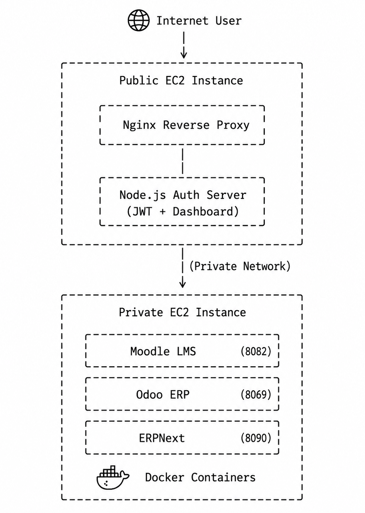
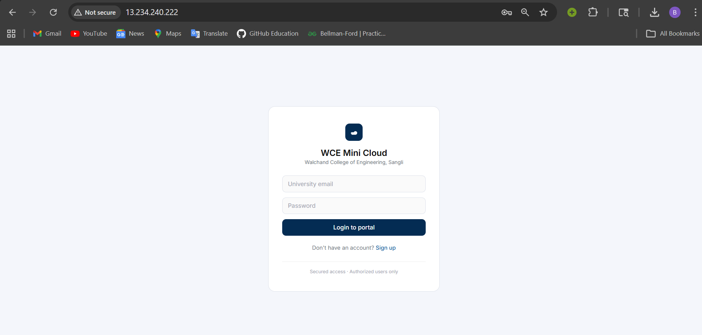
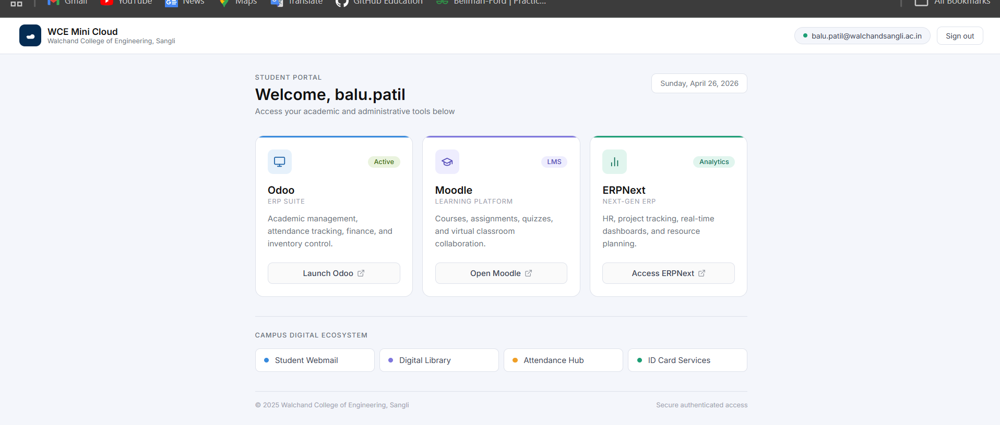
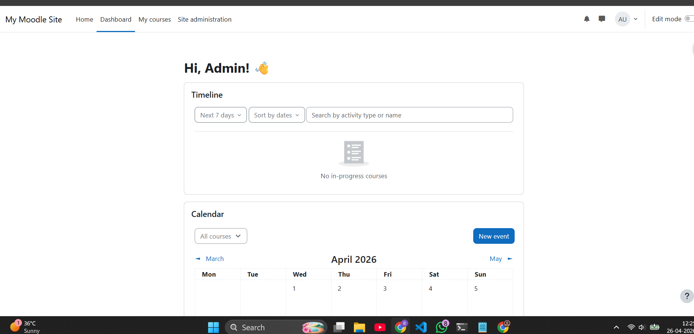
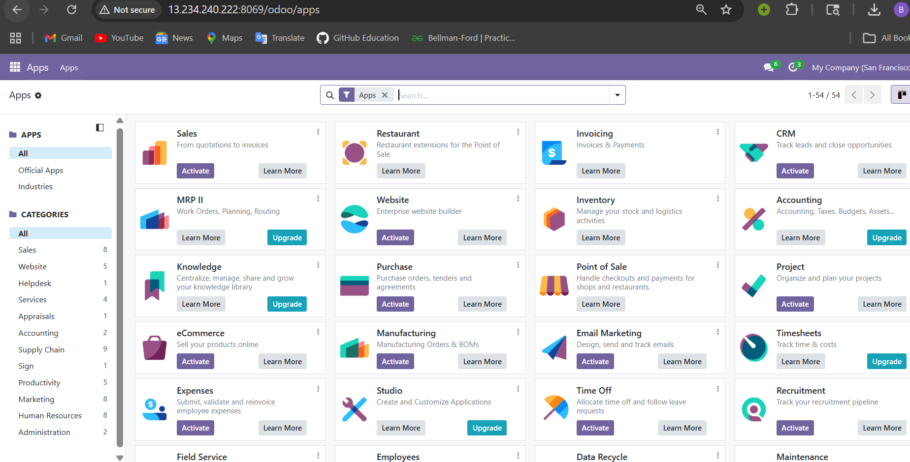
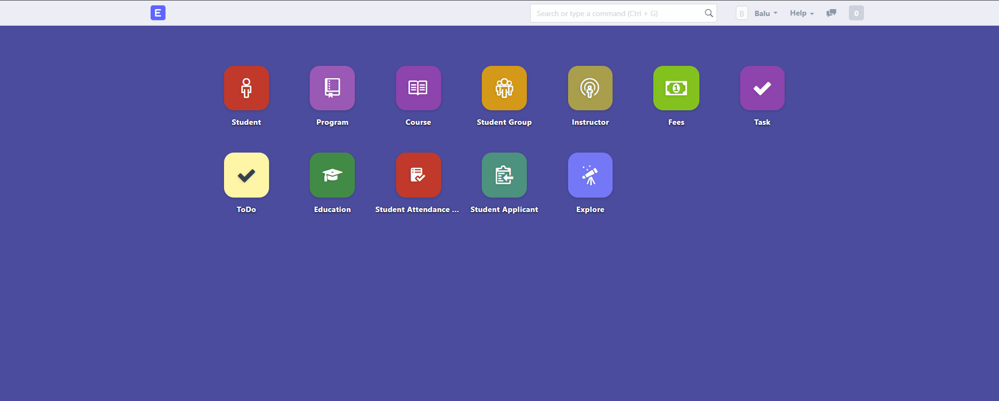

# ☁️ Mini Cloud Platform (DevOps + Full Stack Project)

A cloud-based platform that provides **secure centralized access** to multiple enterprise applications like **Moodle (LMS), Odoo (ERP), and ERPNext**, using a custom authentication system and reverse proxy architecture.

---

## 🚀 Features

* 🔐 Custom Login & Signup System (JWT-based authentication)
* 🌐 Centralized Dashboard to access all services
* 📚 Moodle LMS Integration
* 🏢 Odoo ERP Integration
* 🧠 ERPNext Integration
* 🔁 Reverse Proxy using Nginx
* 🐳 Docker-based deployment
* ☁️ AWS EC2 (Public + Private architecture)
* 🔒 Secure communication using private networking

---

## 🏗️ Architecture



### Flow:

User → Public EC2 (Nginx + Node.js Auth) → Private EC2 (Docker Containers)

* Node.js → Authentication & Dashboard
* Nginx → Reverse Proxy Routing
* Private Server → Runs:

  * Moodle (LMS)
  * Odoo (ERP)
  * ERPNext (ERP)

---

## 🧰 Tech Stack

| Layer      | Technology            |
| ---------- | --------------------- |
| Frontend   | HTML, Tailwind CSS    |
| Backend    | Node.js, Express      |
| Auth       | JWT                   |
| Proxy      | Nginx                 |
| Containers | Docker                |
| Cloud      | AWS EC2               |
| Apps       | Moodle, Odoo, ERPNext |

---

## 🔐 Authentication Flow

1. User logs in via Node.js service
2. JWT token stored in cookie
3. Nginx verifies authentication
4. Access granted to dashboard
5. User navigates to services

---

## 📦 Services

### 📚 Moodle (LMS)

* Learning management system
* Hosted via Docker
* Reverse proxied via Nginx

### 🏢 Odoo (ERP)

* Business management system
* PostgreSQL-backed

### 🧠 ERPNext

* Enterprise resource planning system
* MariaDB-backed

---

## ⚙️ Setup Instructions

### 1. Clone Repo

```bash
git clone https://https://github.com/balupatil9720/cloud-unified-access-platform.git
cd mini-cloud-platform
```

---

### 2. Start Auth Service

```bash
cd auth-service
npm install
node server.js
```

---

### 3. Configure Nginx

```bash
sudo cp nginx/app.conf /etc/nginx/conf.d/
sudo nginx -t
sudo systemctl restart nginx
```

---

### 4. Run Moodle

```bash
cd moodle
docker-compose up -d
```

---

### 5. Run Odoo

```bash
docker run -d \
--name odoo-db \
-e POSTGRES_USER=odoo \
-e POSTGRES_PASSWORD=odoo \
postgres:15

docker run -d \
--name odoo \
-p 8069:8069 \
-e HOST=odoo-db \
-e USER=odoo \
-e PASSWORD=odoo \
odoo
```

---

### 6. Run ERPNext

```bash
docker run -d \
--name erpnext \
-p 8090:80 \
lukptr/erpnext7
```

---

## 📸 Screenshots

### 🔐 Login Page



### 📊 Dashboard



### 📚 Moodle



### 🏢 Odoo



### 🧠 ERPNext



---

## 🚧 Challenges Faced

* Reverse proxy configuration issues
* HTTPS vs HTTP conflicts (Moodle)
* Container networking between EC2 instances
* Authentication integration across services
* Debugging Docker container failures

---

## 💡 Learnings

* Hands-on experience with cloud architecture
* Real-world DevOps deployment
* Reverse proxy & networking concepts
* Docker container orchestration
* Debugging distributed systems

---

## 📌 Future Improvements

* 🔒 HTTPS with SSL (Let's Encrypt)
* 🔗 Clean URLs (/moodle, /odoo, /erpnext)
* 🔐 Single Sign-On (SSO)
* 📊 Monitoring & logging (Prometheus/Grafana)

---

## 👨‍💻 Author

**Balu Patil**

---

## ⭐ Give a Star

If you like this project, give it a ⭐ on GitHub!
